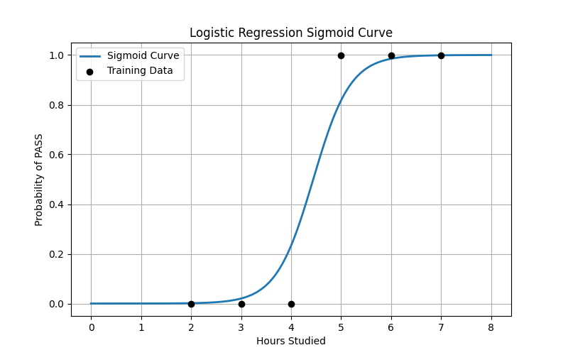
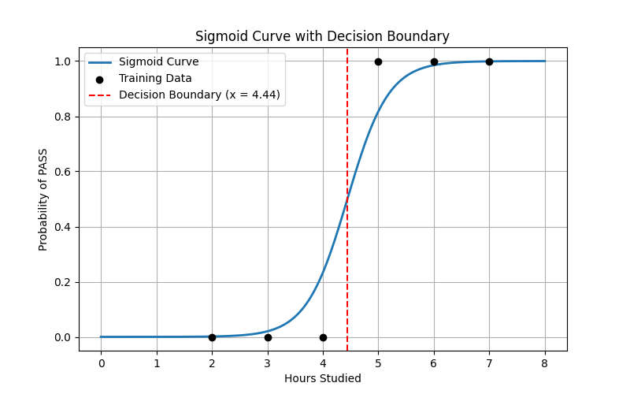

# Day 02 — Logistic Regression (From Scratch)

Logistic Regression is a supervised learning algorithm used to **predict probabilities for categorical outcomes**.  
For example:
- Given the amount of rainfall, what is the probability of a flood?
- Given hours studied, what is the probability that a student will pass?

Unlike linear regression, which predicts continuous values, **logistic regression predicts probabilities bounded between 0 and 1**, which are then converted into class labels.

---

## 1. What is Logistic Regression?

Logistic Regression is a **classification algorithm** that models the probability of a binary outcome using a mathematical function called the **sigmoid (logistic) function**.

The output variable is typically:
- **Binary** (0 or 1)
- Interpreted as **False / True**, **Fail / Pass**, **No / Yes**

### Sigmoid Function

$$\sigma(z) = \frac{1}{1 + e^{-z}}$$

Where:
- $z$ is a linear combination of input features
- The sigmoid squashes any real value into the range **(0, 1)**

#### Properties of the sigmoid:
- $\sigma(z) \to 1$ as $z \to +\infty$
- $\sigma(z) \to 0$ as $z \to -\infty$
- Always bounded between **0 and 1**

Thus:

$$P(y=1) = \sigma(z)$$

$$P(y=0) = 1 - \sigma(z)$$

---

## Types of Problems Logistic Regression Can Handle

- **Binary (Binomial)**  
  Yes / No, True / False, Pass / Fail

- **Multiclass (Multinomial)**  
  Pass / Fail / Backlog (via Softmax extension)

- **Ordinal**  
  Low / Medium / High (ordered categories)

---

## Odds, Log-Odds, and Why We Need Them

Logistic Regression models the **log of odds** of an event occurring.

### Odds
$$\text{Odds} = \frac{P(x)}{1 - P(x)}$$

Where:
- Numerator → event occurs
- Denominator → event does not occur
- $1$ represents the entire probability space

### Log-Odds (Logit)

$$\log\left(\frac{P(x)}{1 - P(x)}\right)$$

Why log-odds?
- Probability is bounded between 0 and 1
- Log-odds range from $-\infty$ to $+\infty$
- This makes it compatible with a **linear model**

---

## 1.1 Logits (Linear Model)

The log-odds are modeled as a linear equation:

$\log(\text{odds}) = \beta_0 + \beta_1 x_1 + \beta_2 x_2 + \dots + \beta_p x_p$

- $\beta_0$ → intercept
- $\beta_i$ → coefficients
- Linear in parameters, non-linear in output probability

### Boundary Behavior

$$P = 0 \Rightarrow \log\left(\frac{0}{1}\right) = -\infty$$

$$P = 1 \Rightarrow \log\left(\frac{1}{0}\right) = +\infty$$

This explains why **logits can span the entire real line**, while probabilities cannot.

---

## 2. The Mathematics Behind Sigmoid

For a single feature:

$$y = \frac{1}{1 + e^{-(a_0 + a_1 x)}}$$

Where:
- $a_0$ → intercept
- $a_1$ → coefficient
- $x$ → independent variable

The parameters $a_0$ and $a_1$ are **learned from data** using:
- Maximum Likelihood Estimation (MLE)
- Gradient Descent optimization

---

## 2.1 Simple Example — Student Pass/Fail

Assume the following dataset:

| Hours Studied | Pass (1) / Fail (0) |
|-------------|---------------------|
| 2 | 0 |
| 3 | 0 |
| 4 | 0 |
| 5 | 1 |
| 6 | 1 |
| 7 | 1 |

After training, suppose the learned parameters are:
- $a_0 = -1.5$
- $a_1 = 0.6$

---

### Case 1: Student studied **5 hours**

$$z = a_0 + a_1 x = -1.5 + 0.6 \times 5 = 1.5$$

$$y = \frac{1}{1 + e^{-1.5}} \approx 0.817$$

**Interpretation:**  
The probability of passing is **81.7% → PASS**

---

### Case 2: Student studied **1.5 hours**

$$z = -1.5 + 0.6 \times 1.5 = -0.6$$

$$y = \frac{1}{1 + e^{0.6}} \approx 0.354$$

**Interpretation:**  
The probability of passing is **35.4% → FAIL**

---

## 3. Decision Boundary

The **decision boundary** is the point where the model is undecided:

$$P(y=1) = 0.5$$

This occurs when:

$$a_0 + a_1 x = 0
\Rightarrow x = -\frac{a_0}{a_1}$$

For this example:

$x = \frac{1.5}{0.6} = 2.5$

### Interpretation:
- If hours studied **< 2.5** → FAIL
- If hours studied **≥ 2.5** → PASS

---

## 4. Graphs

- Decision Boundary marking probability = 0.5  

  

- Sigmoid Curve showing probability vs hours studied  

---

## 5. What I Learned

- Logistic Regression is a **linear classifier**
- Sigmoid converts distance from the boundary into probability
- The decision boundary comes from the linear equation, not the sigmoid
- Cross-entropy loss is essential for classification
- Parameters are learned via **gradient descent**, not solved directly
- Probability ≠ decision; thresholding creates the class label

---

## References

- [GeekForGeeks - machine learning - Logistic Regression](https://www.geeksforgeeks.org/machine-learning/understanding-logistic-regression/) 
- [Learn Analytics - 2. Logistic Regression – Introduction](https://www.youtube.com/watch?v=JuxX-hfRg1o&list=PLJ07VAG7bJEqbhbxYm79EOP4jBHdtJ7lN&index=3) 
- [Visually Explained - Logistic Regression (and why it's different from Linear Regression)](https://www.youtube.com/watch?v=3bvM3NyMiE0&list=PLJ07VAG7bJEqbhbxYm79EOP4jBHdtJ7lN&index=4) 
- [Gate Smashers - Lec-5: Logistic Regression with Simplest & Easiest Example | Machine Learning](https://www.youtube.com/watch?v=r8OjlgWpAI0&list=PLJ07VAG7bJEqbhbxYm79EOP4jBHdtJ7lN&index=6)