# Day 05 - Decision Trees – Entropy & Gini Calculator UI

A Decision Tree is a supervised learning algorithm that makes decisions by recursively splitting data based on feature values.
It is widely used for classification and prediction tasks due to its interpretability.

To decide how to split data at each step, Decision Trees rely on impurity measures, most commonly:

+ Entropy
+ Gini Impurity

This project focuses on understanding and visualizing how these impurity measures work at the node and split level.

## What is Decision Tree?

A Decision Tree helps us make decisions by showing different options and how they are related. It has a tree-like structure that starts with one main question called the root node which represents the entire dataset. From there, the tree branches out into different possibilities based on features in the data.

**Root Node**: Starting point representing the whole dataset. \
**Branches**: Lines connecting nodes showing the flow from one decision to another. \
**Internal Nodes**: Points where decisions are made based on data features. \
**Leaf Nodes**: End points of the tree where the final decision or prediction is made. 

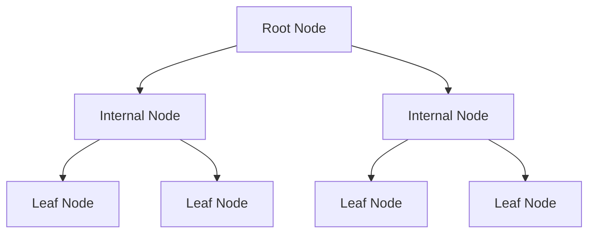

## What is Entropy?

Entropy measures the uncertainty or randomness in a node’s class distribution.
It originates from Information Theory.

+ High entropy → mixed classes (impure)
+ Low entropy → mostly one class (pure)

$\boxed {Entropy = \sum^{n}_{i=1} p_i log_2 (p_i)}$ 

$\text{it can be dumbed down to:}\ -p_1 log_2 p_1 - p_2 log_2 p_2$

> I have a Casio (fx-82MS) 2nd Edition calculator so for exams in university I had a trick to calculate $log_2$ as the *log* button on the calculator is not for a log without base  it will read as $logn$ not $log_n$ which is *log* with base *n*. \
> The trick is: for $log_{base}\ n$ \
> On Calculator: \
> $(log\ n)/(log\ base)$ 

> so for entropy: \
> $-p_1 log_2 p_1 - p_2 log_2 p_2$ \
> on a casio calculator is: \
> $\boxed{-p_1 \times ((log\ p_1)/(log\ 2)) - p_2 \times ((log\ p_2)/(log\ 2))}$

## What is Gini Index?

Gini Impurity checks how often a randomly selected sample would be mislabeled if assigned by class probability.

$\boxed {Gini\ Impurity\ = 1- \sum^{n}_{i=1} {p_i}^2}$

$\text{it can be dumbed down to:}\ 1-{p_1}^2 - {p_2}^2$

## Decision Tree Theory Context
### Algorithms Behind Decision Trees

This project focuses on visualizing impurity calculations (Entropy & Gini) at a single node level.
However, these calculations are fundamental to several well-known decision tree algorithms:

+ ID3 (Iterative Dichotomiser 3): *Uses Entropy and Information Gain to select the best attribute for splitting.*

+ C4.5: *An extension of ID3 that supports continuous attributes and uses Gain Ratio.*

+ CART (Classification and Regression Trees): *Uses Gini Impurity for classification and supports binary splits.*

+ Hunt’s Algorithm: *One of the earliest recursive decision tree induction algorithms that forms the conceptual basis of modern trees.*

> This project does not implement these algorithms end-to-end. Instead, it isolates and visualizes the core decision-making step common to all of them.

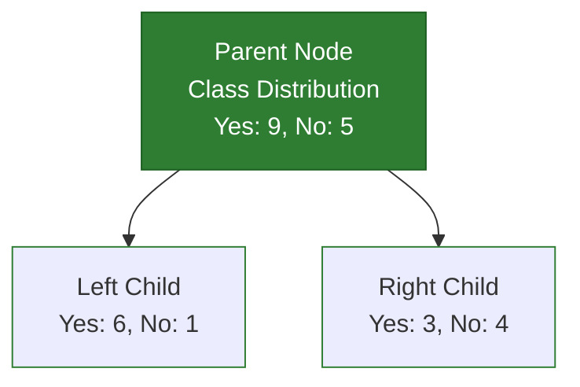

## Node Impurity & Split Selection

Decision Trees follow a greedy strategy:

+ At each node, the algorithm evaluates possible splits 
+ A split is preferred if it results in more homogeneous child nodes
+ Homogeneity is measured using impurity metrics such as:
    + Entropy
    + Gini Impurity

This calculator UI demonstrates:

+ How impurity is computed for a node
+ How impurity changes after a split
+ Why a particular split is considered better than others

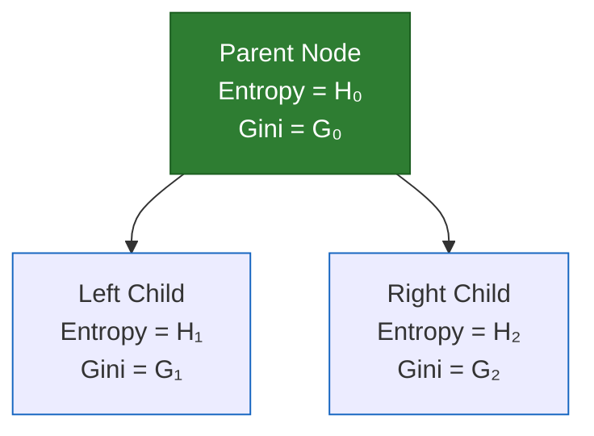

---

## Example for making a Decision Tree

Let's say that this is our dateset,

|Loves popcorn |Loves Soda |Age |Loves 'Cool as Ice'|
|---|---|---|---|
|Yes |Yes |7 |No |
|Yes |No |12 |No |
|No |Yes |18 |Yes |
|No |Yes |35 |Yes |
|Yes |Yes |38 |Yes |
|Yes |No |50 |No |
|No |No |83 |No |

### Deciding the tree top

First we decide whether *"Loves Popcorn", "Loves Soda", "Age" or "Loves 'Cool as Ice'"* is going to be at the top of the tree.

### 1. First condition: ***Loves Popcorn***

There are total of $4$ people who love popcorn and $3$ who do not. 

Out of the ones who ***love*** popcorn there are $3$ who do not love 'Cool as Ice' and $1$ who does. \
Out of the ones who ***dont*** love popcorn there are $2$ who love 'Cool as Ice' and $1$ who does not. 

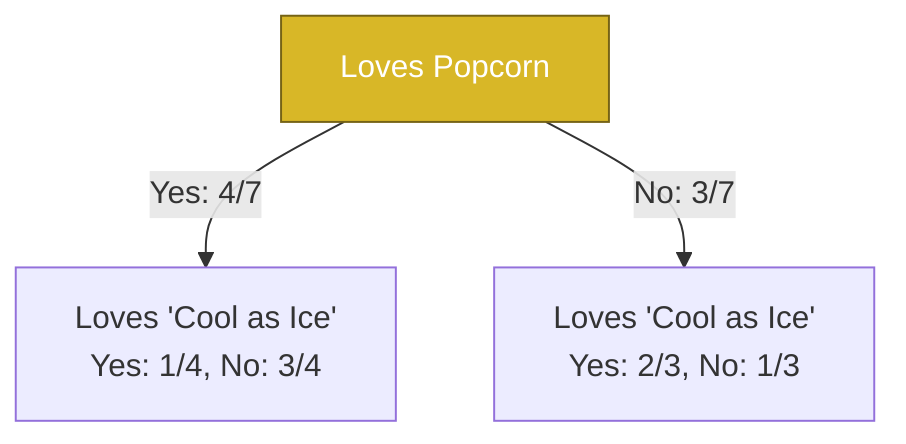

So Gini Impurity of left leaf indicating people who Love popcorn is, \
$1-{p_1}^2 - {p_2}^2$, $p_1$ is Loves 'Cool as Ice' and $p_2$ is Not Loves 'Cool as Ice', $1/4$ and $3/4$ respectively \
$= 1-\frac{1}{4}^{2}-\frac{3}{4}^{2}$ \
$= 1- \frac{1}{16}-\frac{9}{16}$ \
$= 1- 0.0625- 0.5625$ \
$= 0.375$

And, Gini Impurity of right leaf indicating people who Do not Love popcorn is, \
$1-{p_1}^2 - {p_2}^2$, $p_1$ is Loves 'Cool as Ice' and $p_2$ is Not Loves 'Cool as Ice', $2/3$ and $1/3$ respectively \
$= 1-\frac{2}{3}^{2}-\frac{1}{3}^{2}$ \
$= 1- \frac{4}{9}-\frac{1}{9}$ \
$= 1- 0.445- 0.112$ \
$= 0.443$

As the total number of people is not the same in both leaves, \
$\text{Total Gini Impurity = weighted average of gini impurities of each leaf}$ \
$= \frac{4}{7}0.375 + \frac{3}{7}0.443$ \
$= 0.214 + 0.189$ \
$= 0.403$

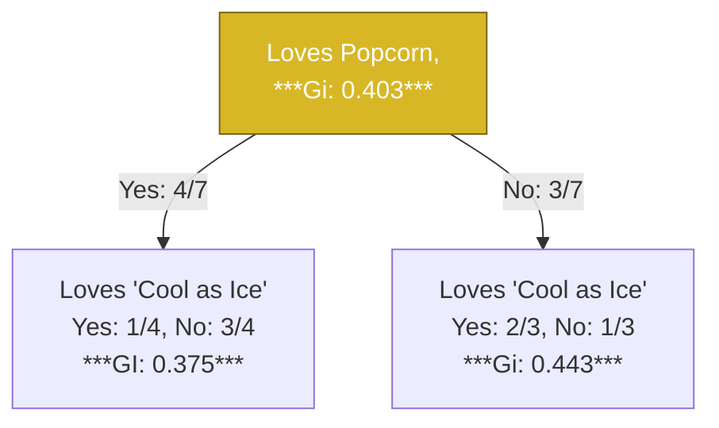

### 2. Second condition: ***Loves Soda***

There are total of $4$ people who love soda and $3$ who do not. 

Out of the ones who ***love*** soda there are $3$ who  love 'Cool as Ice' and $1$ who does not. \
Out of the ones who ***dont*** love soda, no one loves 'Cool as Ice'. 

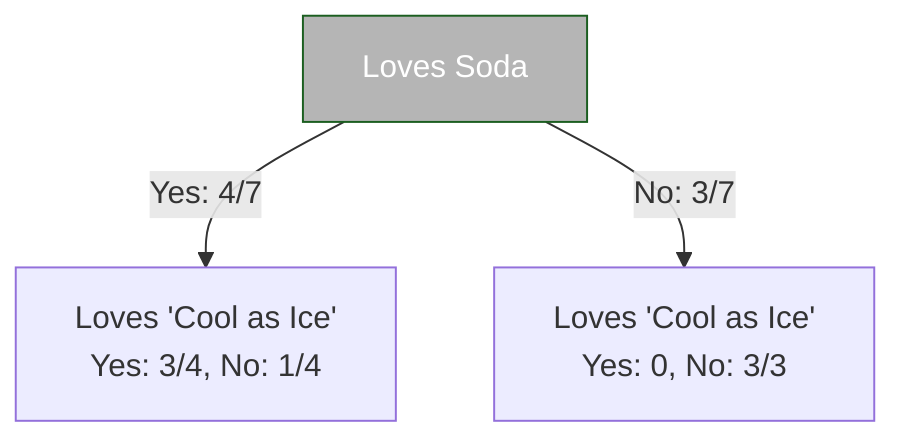

So Gini Impurity of left leaf indicating people who Love soda is, \
$1-{p_1}^2 - {p_2}^2$, $p_1$ is Loves 'Cool as Ice' and $p_2$ is Not Loves 'Cool as Ice', $3/4$ and $1/4$ respectively \
$= 1-\frac{3}{4}^{2}-\frac{1}{4}^{2}$ \
$= 1- \frac{9}{16}-\frac{1}{16}$ \
$= 1- 0.5625- 0.0625$ \
$= 0.375$

And, Gini Impurity of right leaf indicating people who Do not Love soda is, \
$1-{p_1}^2 - {p_2}^2$, $p_1$ is Loves 'Cool as Ice' and $p_2$ is Not Loves 'Cool as Ice', $0$ and $3/3=1$ respectively \
$= 1-0^{2}-1^{2}$ \
$= 1- 0- 1 =0$ 

As the total number of people is not the same in both leaves, \
$\text{Total Gini Impurity = weighted average of gini impurities of each leaf}$ \
$= \frac{4}{7}0.375 + \frac{3}{7}0$ \
$= 0.214 + 0$ \
$= 0.214$

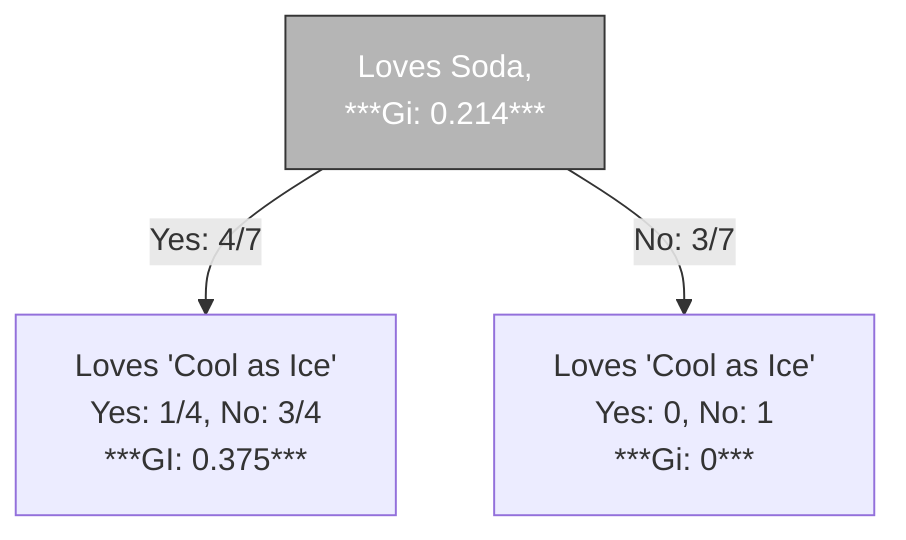

### 3. Second condition: ***Age***

As age is numerical value and not a binary value like Yes/No, we first allign the ages in ascending order, then we calculate the average age of all adjacent values and find their gini impurity. 

|Age|Average|Loves 'Cool as Ice'|
|---|---|---|
|7 | - |No 
|12 | 9.5 |No
|18 | 15 |Yes
|35 | 26.5 |Yes
|38 | 36.5 |Yes
|50 | 44 |No
|83 | 66.5 |No

**Avg 9.5**

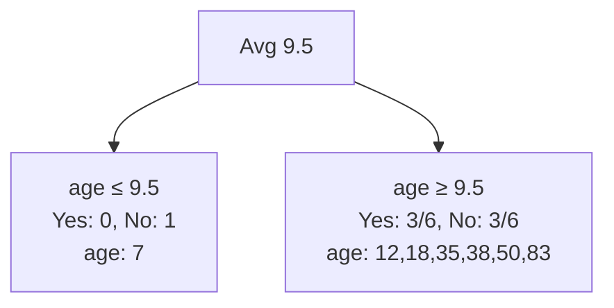

Gini Impurity of Avg 9.5, \
$Left\ = 0,\ Right\ = 0.5$

$\boxed {Total=\frac{1}{7}​(0)+ \frac{6}{7}​(0.5)=0.4286}$

**Avg 15**

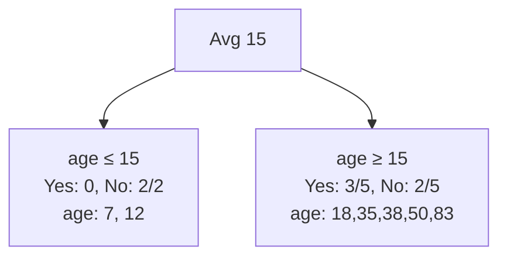

Gini Impurity of Avg 15, \
$Left\ = 0,\ Right\ = 0.48$

$\boxed {Total=\frac{3}{5}​(0)+ \frac{2}{5}​(0.48)=0.3429}$

Similarly the GI for all would be, 

|Age|Average|Loves 'Cool as Ice'|Gini Impurity|
|---|---|---|---|
|7 | - |No | -
|12 | 9.5 |No | 0.429
|18 | 15 |Yes | 0.343 
|35 | 26.5 |Yes | 0.476
|38 | 36.5 |Yes | 0.476
|50 | 44 |No | 0.343
|83 | 66.5 |No |0.429

$15$ and $44$ are tied to have the lowest value of $0.343$ so we can pick any of them. 

### LAST LEG:

Now that we have the Gini Impurity of \
***"Loves Popcorn" = 0.403*** \
***"Loves Soda" = 0.214*** \
***"Loves 'Cool as Ice'" = 0.343***

We can see that "Loves Soda" has the least impurity of 0.214, so this category will be at the top of the tree.

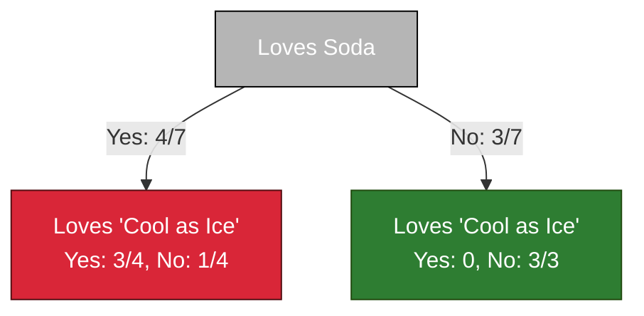

Here, \
the Yes sub category has $3\ Yes$ and $1\ No$, so this left node is impure, \
whereas the right node has $0\ Yes$ and $3\ Nos$ which makes it pure.

Next step is to try to make the left node pure by splitting to either $loves\ popcorn$ or $age$.

***Loves popcorn***

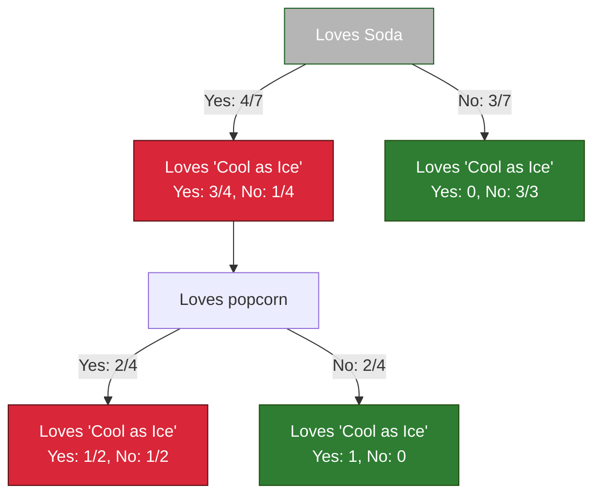

Total Gini Impurity for this leaf is $0.25$

***Age***

Only calculating for the ages who Love Soda,

|Age|Average|Loves 'Cool as Ice'|
|---|---|---|
|7 | - |No | -
|18 | 12.5 |Yes |
|35 | 26.5 |Yes | 
|38 | 36.5 |Yes |

And ages < 12.5 give the lowest impurity of $0$

Age < 12.5 
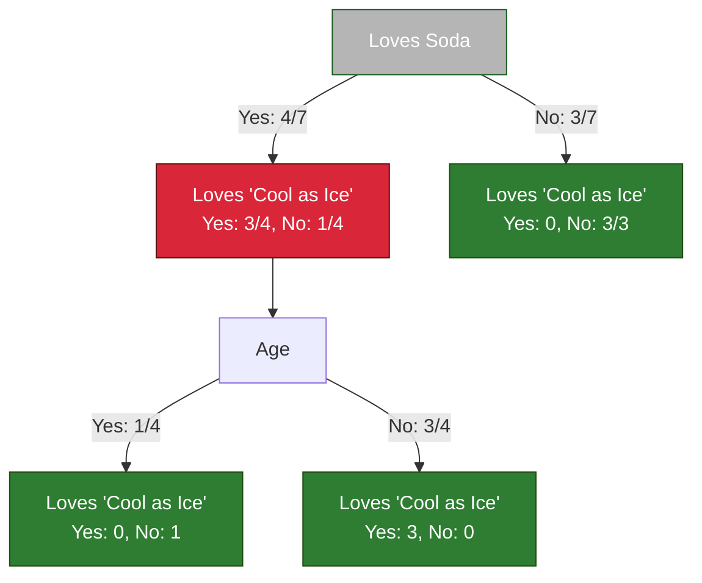

As both leaves of $Age\ <12.5$ gave impurity 0, \
We will use $Age\ <12.5$ as the split to make it pure.

### End result

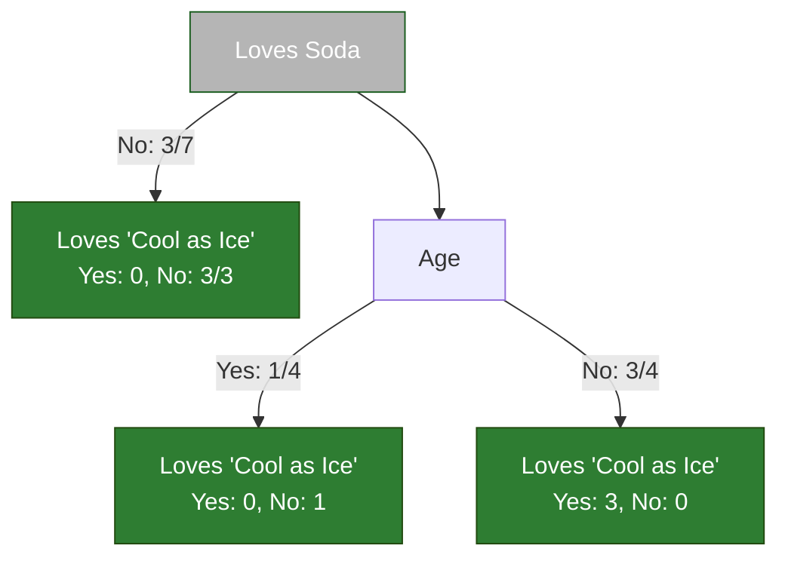

Can be dumbed down to,

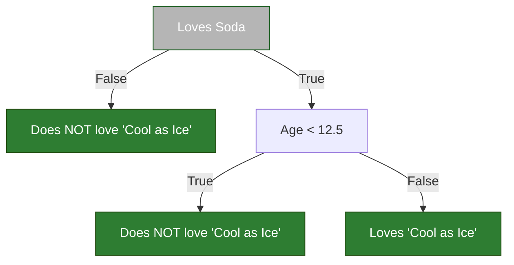

Let say if there is a new data now,

|Love popcorn|Loves Soda|Age|Loves 'Cool as Ice'
|---|---|---|---
|Yes |Yes |15 | ???

They do love soda so starting from the top of the tree, \
***Loves Soda*** = TRUE \
Next is Age, \
***Age < 12.5*** = FALSE, \
So they fall into the $Loves\ 'Cool\ as\ Ice'$ category.

> all of this took me 2 days of understanding and typing it down

---

## Limitations of Decision Trees

+ Prone to overfitting
+ Sensitive to small data changes
+ Greedy and not globally optimal

## What I Learned

+ How trees choose splits mathematically
+ Why Gini and Entropy behave differently
+ How continuous features are handled
+ Why interpretability matters in ML

## References

1. [Gate Smashers – Lec-8: Naive Bayes Classification Full Explanation with examples | Supervised Learning](https://www.youtube.com/watch?v=GBMMtXRiQX0)
2. [StatQuest with Josh Starmer - Naive Bayes, Clearly Explained!!!](https://www.youtube.com/watch?v=O2L2Uv9pdDA&list=PLJ07VAG7bJEqbhbxYm79EOP4jBHdtJ7lN&index=12)
3. [Mahesh Huddar - 1. Solved Example Naive Bayes Classifier to classify New Instance PlayTennis Example Mahesh Huddar](https://www.youtube.com/watch?v=XzSlEA4ck2I&list=PLJ07VAG7bJEqbhbxYm79EOP4jBHdtJ7lN&index=14)
4. ChatGPT
5. [StatQuest with Josh Starmer - Entropy (for data science) Clearly Explained!!!](https://www.youtube.com/watch?v=YtebGVx-Fxw&list=PLJ07VAG7bJEqbhbxYm79EOP4jBHdtJ7lN&index=18)