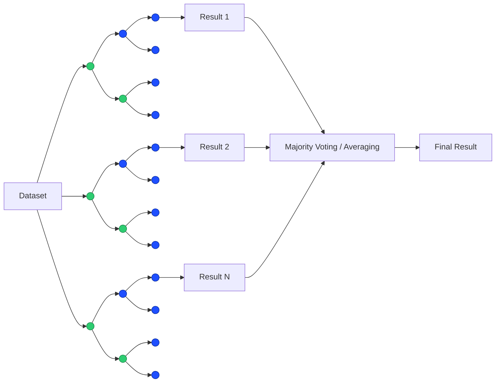

# Day 06 - Random Forest - Feature Importance Explainer

Random Forest or Random Decision Forests is an ensemble learning method for classification or regression. It corrects the [decision tress'](https://github.com/AnnaNutzz/50-Days-50-ML-AI-Projects/tree/main/projects/day_05_decision_trees) issue of overfitting of training dataset.

## What is Random Forest?

Random Forest is a machine learning algorithm that uses many decision trees to make better predictions. Each tree looks at different random parts of the data and their results are combined by voting for classification or averaging for regression which makes it as ensemble learning technique. This helps in improving accuracy and reducing errors.

Random Forest algorithm has steps to it:
1. **Bootstrapping**: Create a "bootstrapped" dataset from main dataset
2. **Random Feature Selection**: Create randomized decision trees out of the bootstrapped dataset
3. **Aggregating Predictions**: The final output is decided by choosing the output with the most frequency from the randomized decision trees 

## Missing values in dataset

If the dataset has missing values we make a 'bad guess' first and as we progress through with it we change our guess to a possibily a 'good guess' (better guess than before). \
We find the most common value from the data having the same result as the data having missing value. \
If it is a numeric value, we find the median with the values which have the same result as the data with missing values.

Now to refine the 'bad guess' we made previously, we find the similiar data from the dataset. \
We can do this by:
1. building a random forest
2. running all the data down all the trees finding the data having the exact match as the data with missing value \
    *a. we make a proximity table for every tree which has shown similarities*

    example, lets say: \
    sample 3 and 4 show similarity: \
        it has a row for every sample and a column for every sample. so,

    | |1 |2 |3 |4 |
    |---|---|---|---|---|
    |1 |
    |2 |
    |3 | |||1|
    |4 | ||1||

    From the second tree we start to add $1$ to every pair of samples having the same leaf node. Lets say in tree 2, samples 2,3,4 showed similarity, then,

    | |1 |2 |3 |4 |
    |---|---|---|---|---|
    |1 |
    |2 | | |1|1|
    |3 | |1| |2|
    |4 | |1|2| |

    And in the tree 3, samples 3 and 4 showed similarity again, then,

    |  |1 |2 |3 |4 |
    |---|---|---|---|---|
    |1 |
    |2 | | |1|1|
    |3 | |1| |3|
    |4 | |1|3| |

   *b. now that we have a proximity table, we can have proximity values in it*

    |  |1 |2 |3 |4 |
    |---|---|---|---|---|
    |1 |
    |2 | | |1|1|
    |3 | |1| |3|
    |4 | |1|3| |
        
    lets say we have 10 datasets, we divide the proximity value by the total number of trees and use the proximity values of data sample having the missing value,

    |  |1 |2 |3 |4 |
    |---|---|---|---|---|
    |1 |
    |2 | | |0.1|0.1|
    |3 | |0.1| |0.9|
    |4 | |0.1|0.9| |

    the better guess for the value can be made by calculating the weighted frequency of the values using proximity values as weights:

    $\text{weighted frequency = frequency of the value} \times \text{weight of the value}$

    $\text{weight of the value = proximity of the value/ total of all proximity of the sample}$

    and if the value is numeric, \
    $\text{weighted avg = sum of (all samples value} \times \text{proximity value)}$

and now that the guesses have been refined a little bit, we have to do the whole ordeal again. we do this continuously until the missing values converge/dont change everytime we recalculate.

---

# Example

## 1. Bootstrapping

Multiple datasets are created from the original dataset using sampling with replacement. Each dataset is used to train one decision tree.

## 2. Random Feature Selection

When building each decision tree, the algorithm randomly selects a subset of features at each split and chooses the best split among them. This introduces randomness and reduces correlation between trees.

## 3. Aggregating Predictions

The predictions from all trees are combined:

+ Classification: majority voting
+ Regression: average of predictions

The aggregated prediction becomes the final output of the Random Forest model.

---

## Limitations of Random Forest 

## What I Learned

## References

1. [Gate Smashers - Lec-18: Random Forest 🌳 in Machine Learning 🧑‍💻👩‍💻](https://www.youtube.com/watch?v=DXqxXe3rep0&list=PLJ07VAG7bJEqbhbxYm79EOP4jBHdtJ7lN&index=26)
2. [StatQuest with Josh Starmer - StatQuest: Random Forests Part 1 - Building, Using and Evaluating](https://www.youtube.com/watch?v=O2L2Uv9pdDA&list=PLJ07VAG7bJEqbhbxYm79EOP4jBHdtJ7lN&index=12)
3. [StatQuest with Josh Starmer - StatQuest: Random Forests Part 2: Missing data and clustering](https://www.youtube.com/watch?v=sQ870aTKqiM&list=PLJ07VAG7bJEqbhbxYm79EOP4jBHdtJ7lN&index=27)
4. ChatGPT
