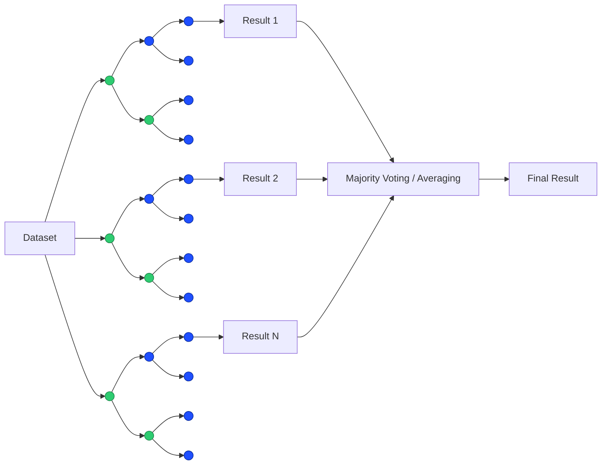

# Day 06 — Random Forest: Feature Importance Explainer

Random Forest (also known as **Random Decision Forests**) is an **ensemble learning algorithm** used for both **classification and regression** tasks. It improves upon the limitations of [Decision Trees](https://github.com/AnnaNutzz/50-Days-50-ML-AI-Projects/tree/main/projects/day_05_decision_trees), particularly the tendency of single trees to **overfit the training dataset**.

---

# What is Random Forest?

Random Forest is a machine learning algorithm that builds **multiple decision trees** and combines their predictions to produce a more accurate and stable result.

Each tree is trained on a **random subset of the data** and uses **random subsets of features** when making splits. The predictions from all trees are then combined:

- **Classification:** majority voting  
- **Regression:** averaging the predictions  

Because multiple models contribute to the final decision, Random Forest is considered an **ensemble learning technique**.

This approach improves generalization and reduces variance compared to a single decision tree.

---

# Steps in the Random Forest Algorithm

Random Forest works through three main steps:

## 1. Bootstrapping

A **bootstrapped dataset** is created from the original dataset using **sampling with replacement**.

- Some samples may appear multiple times.
- Some samples may not appear at all.

Each bootstrapped dataset is used to train **one decision tree**.

## 2. Random Feature Selection

While constructing each decision tree, the algorithm randomly selects a **subset of features at each split**.

The best split is chosen only from this subset of features rather than all available features.

This randomness helps reduce correlation between trees and improves model robustness.

## 3. Aggregating Predictions

Once all trees make predictions, the results are combined.

For **classification**, the final prediction is determined by **majority voting** among all trees.

For **regression**, the final prediction is the **average of all tree outputs**.

This aggregation step produces the **final model prediction**.

---

# Handling Missing Values in Random Forest

Random Forest can also be used to **estimate missing values** in a dataset.

## Initial Guess

If a dataset contains missing values, an initial **rough estimate ("bad guess")** is made.

- For **categorical values**, the most common value among samples with the same class label is used.
- For **numerical values**, the **median** of samples with the same class label is used.

## Refining the Guess Using Proximity

The initial guess is refined by identifying **similar samples** in the dataset.

This process works as follows:

1. A Random Forest is trained.
2. All samples are passed through every tree.
3. If two samples land in the **same leaf node**, they are considered similar.

A **proximity table** is constructed to track how frequently samples appear together in the same leaf nodes.

### Example

Suppose **sample 3 and sample 4** land in the same leaf node.

The proximity table records this similarity.

| |1 |2 |3 |4 |
|---|---|---|---|---|
|1 |
|2 |
|3 | | | |1|
|4 | | |1| |

If in another tree **samples 2, 3, and 4** land together, the table updates:

| |1 |2 |3 |4 |
|---|---|---|---|---|
|1 |
|2 | | |1|1|
|3 | |1| |2|
|4 | |1|2| |

If in another tree **samples 3 and 4** match again:

| |1 |2 |3 |4 |
|---|---|---|---|---|
|1 |
|2 | | |1|1|
|3 | |1| |3|
|4 | |1|3| |

## Converting to Proximity Values

The proximity score is divided by the **total number of trees**.

Example (10 trees):

| |1 |2 |3 |4 |
|---|---|---|---|---|
|1 |
|2 | | |0.1|0.1|
|3 | |0.1| |0.9|
|4 | |0.1|0.9| |

These proximity values help determine which samples are **most similar** to the one with missing data.

## Updating the Guess

*For **categorical values**:*

$\boxed{\text{weighted frequency = frequency} \times \text{weight}}$ 

$\boxed{\text{weight = proximity / total proximity}}$

*For **numerical values**:*

$\boxed{\text{weighted average = Σ(sample value} \times \text{proximity value)}}$

> This process is repeated multiple times until the estimates **converge** and stop changing significantly.

---

# Example

## 1. Bootstrapping

Multiple datasets are created from the original dataset using **sampling with replacement**.  
Each dataset is used to train one decision tree.

## 2. Random Feature Selection

When building each decision tree, the algorithm randomly selects a subset of features at each split and chooses the best split among them.

This introduces randomness and reduces correlation between trees.

## 3. Aggregating Predictions

The predictions from all trees are combined:

- **Classification:** majority voting  
- **Regression:** average of predictions  

The aggregated prediction becomes the final output of the Random Forest model.

---

# Limitations of Random Forest

- **Less interpretable** compared to a single decision tree.
- **Training can be computationally expensive** with very large datasets.
- Feature importance from Random Forest can sometimes be **biased toward features with many unique values**.

---

# What I Learned

- How Random Forest reduces overfitting by combining multiple decision trees.
- The importance of **bootstrapping and feature randomness**.
- How predictions are aggregated using **majority voting or averaging**.
- How Random Forest can also be used for **handling missing values through proximity calculations**.

---

# References

1. [Gate Smashers - Lec-18: Random Forest 🌳 in Machine Learning 🧑‍💻👩‍💻](https://www.youtube.com/watch?v=DXqxXe3rep0&list=PLJ07VAG7bJEqbhbxYm79EOP4jBHdtJ7lN&index=26)
2. [StatQuest with Josh Starmer - StatQuest: Random Forests Part 1 - Building, Using and Evaluating](https://www.youtube.com/watch?v=O2L2Uv9pdDA&list=PLJ07VAG7bJEqbhbxYm79EOP4jBHdtJ7lN&index=12)
3. [StatQuest with Josh Starmer - StatQuest: Random Forests Part 2: Missing data and clustering](https://www.youtube.com/watch?v=sQ870aTKqiM&list=PLJ07VAG7bJEqbhbxYm79EOP4jBHdtJ7lN&index=27)
4. ChatGPT
